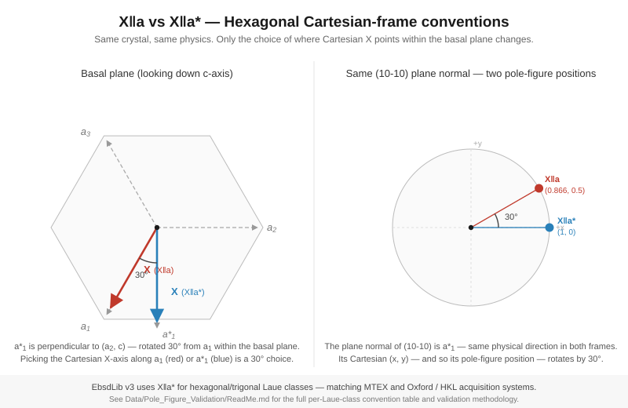

# Various Bits of Documentation for EbsdLib

EbsdLib is primarily used in the [DREAM3D](https://www.dream3d.io) family of applications and libraries.

## Rotation Point Groups

The PDF is courtesy of Dr. Anthony Rollett from Carnegie Mellon University. The original
URL is [http://pajarito.materials.cmu.edu/lectures/L3-OD_symmetry-21Jan16-slide_50-operators.pdf](http://pajarito.materials.cmu.edu/lectures/L3-OD_symmetry-21Jan16-slide_50-operators.pdf)

## Hexagonal Cartesian Conventions: X‖a vs X‖a*

EbsdLib v3 aligned its hexagonal and trigonal direction conventions to `X‖a*`, matching
MTEX and Oxford Instruments / HKL acquisition systems. (EDAX/TSL/OIM Analysis use the
other convention, `X‖a`.) The 30° rotation between the two conventions is what caused
the original `(10-10)` and `(2-1-10)` pole-figure mismatches before the v3 changes.



Position-space validation across all 11 Laue classes lives in
[`Data/Pole_Figure_Validation/`](../Data/Pole_Figure_Validation/ReadMe.md).

---

# Release Notes — EbsdLib 3.0.0

EbsdLib 3.0 is the "MTEX-compatible pole figures and IPF coloring" release.
The two themes are:

1. **Crystallographic correctness for hexagonal / trigonal systems** —
   direction conventions, basal-plane plane families, and pole-figure
   positions now match MTEX out of the box (validated to `< 10⁻⁷` against
   MTEX 6.1.0 across all 11 Laue classes).
2. **Pluggable IPF coloring** — `ColorKeyKind` enum selects between TSL
   (DREAM3D-legacy), PUCM (perceptually uniform, Nolze 2016), and
   Nolze-Hielscher color keys at the call site, with optional grid-snapped
   ("flat-shaded") variants for MTEX-style legends.

Detailed API reference: [`v3_api_reference.md`](v3_api_reference.md).

## Breaking changes

Source consumers of EbsdLib must touch each of these only if they were
calling the affected symbol. The simplnx / DREAM3DNX / DREAM3D_Plugins
trees compile clean against v3 without source changes (audited; see the
v3 release checklist).

### Public LaueOps signature changes

- `generateSphereCoordsFromEulers(eulers, c1, c2, c3)` →
  `generateSphereCoordsFromEulers(eulers, c1, c2, c3, ebsdlib::HexConvention conv)`.
  Cubic / tetragonal / orthorhombic / monoclinic / triclinic overrides
  ignore `conv`; pass `HexConvention::NotApplicable`. Hex and trigonal
  overrides honor it.
- `getDefaultPoleFigureNames()` →
  `getDefaultPoleFigureNames(ebsdlib::HexConvention conv)`. Hex/trig classes
  return different labels per convention (`<10-10>` ↔ `<2-1-10>` shuffles);
  cubic/tet/ortho/mono/triclinic return the same labels regardless.
- `generateIPFTriangleLegend(int imageDim, bool generateEntirePlane)` →
  `generateIPFTriangleLegend(int imageDim, bool generateEntirePlane,
  ebsdlib::HexConvention conv, ebsdlib::ColorKeyKind kind =
  ebsdlib::ColorKeyKind::TSL, bool gridded = false)`. The `kind` and
  `gridded` arguments default; `conv` does not, because the legend itself
  draws different labels under the two bases.
- `generateIPFColor(eulers, refDir, convertDegrees)` →
  `generateIPFColor(eulers, refDir, convertDegrees, ebsdlib::ColorKeyKind kind =
  ebsdlib::ColorKeyKind::TSL)`. The `kind` defaults to TSL — pre-v3 callers
  recompile unchanged and get the same colors. Note that IPF coloring is
  now **convention-invariant** (it operates on the sample-frame reference
  direction, which never sees the basal basis); the pre-v3 `HexConvention`
  parameter some patches briefly added was removed before release.

### Enum shifts

  Code that uses the named values is unaffected. Code that
  `static_cast<HexConvention>(int)` from a UI index needs the cast target
  to match the new ordering — confirm by reading the new enum, not by
  remembering pre-v3 integer values.

### Symmetry orbit / direction-table changes

Several low-symmetry Laue classes had their symmetry orbits expanded as
part of the SymOps refactor (PR 2a–2d). Pole figures rendered before/after
v3 will not be byte-identical for these classes — the sym-op count for the
same Laue class changed. Position-space tests pass (`< 10⁻⁷` vs MTEX), so
this is a correctness fix, not a regression. If you pin byte-level pixel
exemplars at the simplnx layer (the way the now-deprecated
`PoleFigure_Exemplars_v5.tar.gz` did), regenerate those baselines against
v3 output.

### Image output format

- `make_pole_figure`, `make_ipf`, `render_ebsd`, and the simplnx
  `WritePoleFigureFilter` / `WriteIPFImageFilter` filters now emit PNG
  (via STB image) instead of TIFF. Consumers that watched for `*.tiff`
  pole-figure output need to watch for `*.png` instead. The pixel content
  is the same up to PNG-encoder differences from libtiff.

## New features

### `ColorKeyKind` and per-class color keys

```cpp
enum class ColorKeyKind : uint8_t {
  TSL = 0,            // EDAX / DREAM3D-legacy IPF coloring
  PUCM = 1,           // Perceptually uniform (Nolze 2016)
  NolzeHielscher = 2  // Nolze-Hielscher color key
};
```

Each `LaueOps` subclass owns a per-class singleton for each kind. The
TSL singleton is shared across all classes (it's the standard EDAX
mapping); PUCM is parameterized by rotation point group; Nolze-Hielscher
is parameterized by the fundamental sector. Callers select among them at
the call site by passing the kind enum to `generateIPFColor` or
`generateIPFTriangleLegend` — instances stay stateless, no setter API.

### `HexConvention::NotApplicable` sentinel

Cubic / tetragonal / orthorhombic / monoclinic / triclinic Laue classes
have no `X‖a` vs `X‖a*` distinction to make. The `NotApplicable` value
is the right thing for those classes to pass when one of the new
hex/trig-aware APIs requires the convention parameter. The hex/trig
overrides assert if they receive `NotApplicable`, and the non-hex/trig
overrides ignore the parameter regardless of its value.

### Gridded color-key legends

`generateIPFTriangleLegend(..., gridded=true)` wraps the selected color
key in a `GriddedColorKey` (~1° eta × chi resolution), producing
MTEX-style flat-shaded cells instead of a smooth continuous gradient.
Useful for visually matching MTEX legend renders side-by-side.

### `render_ebsd` CLI driver

New app at `Source/Apps/render_ebsd.cpp`. Single-binary entry point for
pole figure, IPF map, and IPF legend rendering against a `.ang` / `.ctf`
input — useful for CI smoke tests and reference renders. Rejects missing
output directories and bad positional arguments before doing any work.

### `InversePoleFigureConfiguration_t` carries `HexConvention`

The IPF rendering config struct now has a `hexConvention` field so the
hex/trig-aware code paths (legend labels, basal-plane direction tables)
can be routed through the same configuration object the existing
`PoleFigureConfiguration_t` uses.

### Cropped IPF triangle legends

`generateIPFTriangleLegend` output is now cropped to the SST contents
(plus a small margin). No more wasted whitespace on classes whose
fundamental sector occupies only a fraction of the unit triangle.

## Apps that changed

| App | Status |
| --- | ------ |
| `make_pole_figure` | rewritten — STB/PNG output, MTEX-compatible pole positions, HexConvention-aware family labels |
| `make_ipf`          | rewritten — STB/PNG output, ColorKeyKind dispatch |
| `generate_ipf_legends` | new flags for color key + gridded variant; emits per-class legend matrix |
| `render_ebsd`       | **new** — single-binary pole-figure / IPF map / IPF legend renderer for `.ang` / `.ctf` inputs |
| `generate_pole_figure` | unchanged surface, but inherits the renderer overhaul |
| `generate_ipf_from_file` | unchanged surface |


## Validation evidence

- **Position-space test.** `PoleFigurePositionTest` (Catch2) compares
  EbsdLib pole figure positions against an MTEX-generated golden CSV
  across 396 buckets (12 canonical orientations × 11 Laue classes ×
  3 plane families). Worst max-distance: `6.29 × 10⁻⁸` at `1e-5`
  tolerance. See [`Data/Pole_Figure_Validation/ReadMe.md`](../Data/Pole_Figure_Validation/ReadMe.md).
- **Renderer reproducibility.** `PoleFigureCompositorTest::All_Laue_Classes`
  pins byte-level renderer output across every Laue class.
- **HexConvention plumbing.** simplnx `WritePoleFigureFilter` has two
  test cases: a mask-effectiveness test (`Pole_Figure_Exemplars_v6`) and
  a HexConvention plumbing test that asserts both the intensity array
  AND the composite RGB image differ when switching X‖a → X‖a* on hex
  data.
- **Convention story.** The geometric picture is in
  [`x_parallel_a_star_convention.svg`](x_parallel_a_star_convention.svg);
  the canonical internal direction tables are `X‖a*`, matching MTEX.
