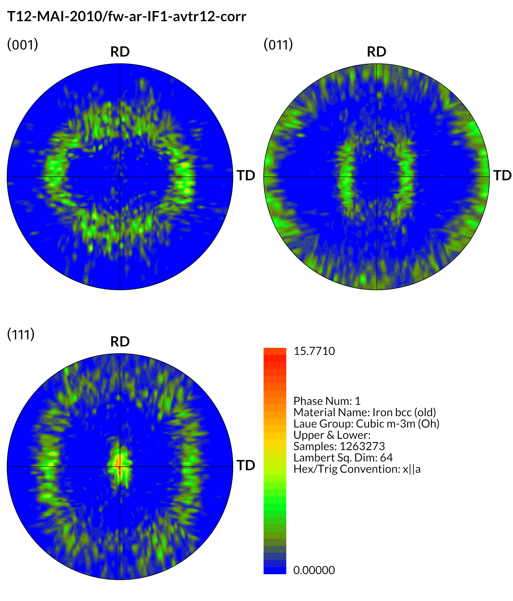
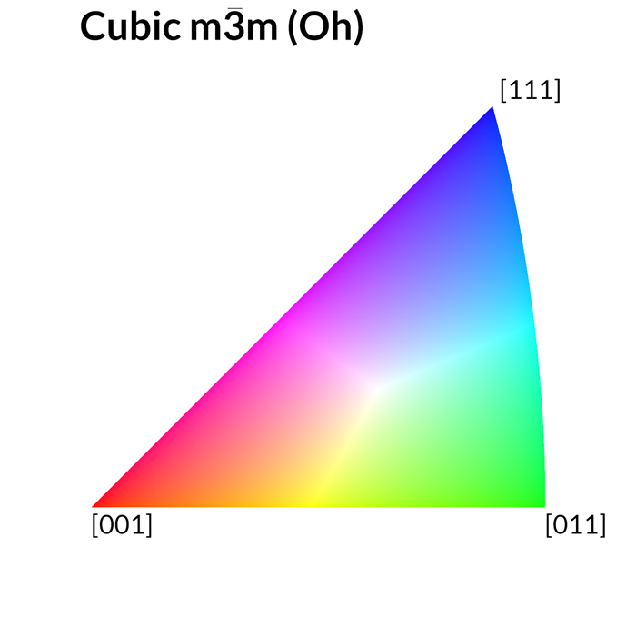
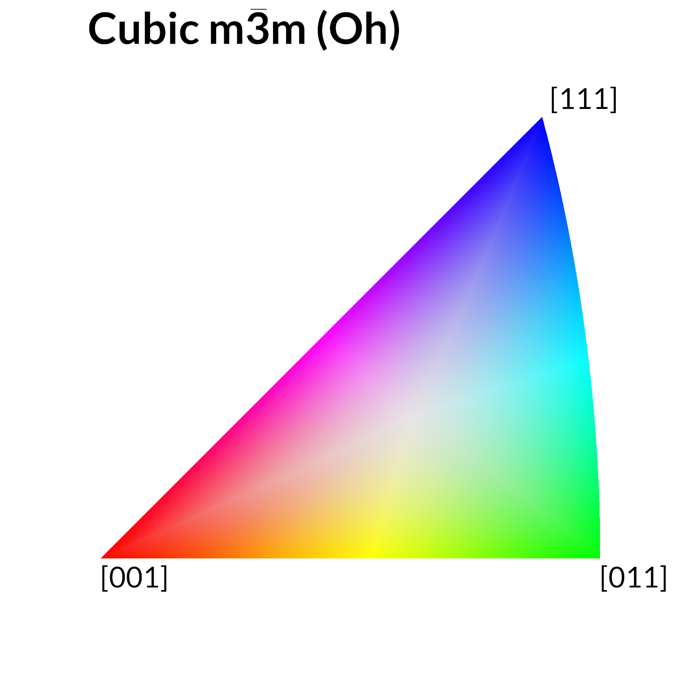
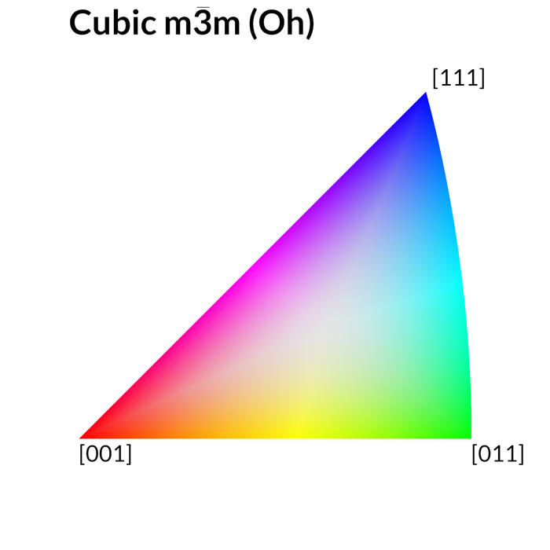
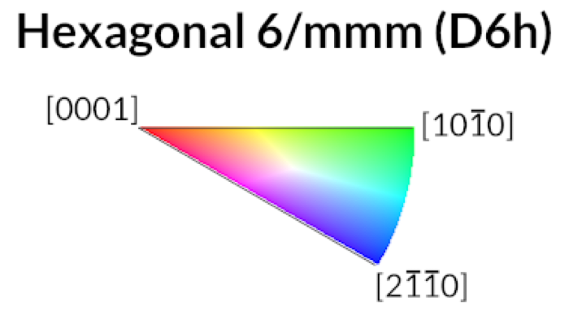

<h1 align="center">EbsdLib</h1>

<p align="center">
  <b>A modern C++20 library for reading, processing, and visualizing Electron Backscatter Diffraction (EBSD) data.</b>
</p>

<p align="center">
  <a href="https://github.com/BlueQuartzSoftware/EbsdLib/actions/workflows/windows.yml"></a>
  <a href="https://github.com/BlueQuartzSoftware/EbsdLib/actions/workflows/linux.yml"></a>
  <a href="https://github.com/BlueQuartzSoftware/EbsdLib/actions/workflows/macos.yml"></a>
  <br>
  
  
  <a href="LICENSE"></a>
</p>

---

EbsdLib reads EBSD files from all major OEM instruments and performs the core
crystallographic processing used throughout materials science:
conversion between the seven orientation representations, Laue-class–aware
fundamental-zone reduction, **Inverse Pole Figure (IPF) coloring**,
**IPF color-key legends**, and **pole figure** generation.

It is the crystallographic engine behind the
[DREAM.3D](https://dream3d.bluequartz.net) and
[DREAM3D-NX](https://www.dream3d.io) projects.

## Features

- **Read every major OEM format** — EDAX/AMETEK (`.ang`, HDF5), Oxford Instruments (`.ctf`, `.h5oina`), and Bruker (HDF5).
- **All 32 crystallographic point groups**, dispatched through the 11 Laue classes.
- **Seven orientation representations** with direct, mathematically exact conversions between them.
- **IPF color maps** rendered directly from a scan, with three selectable color keys — **TSL** (EDAX/AMETEK), **PUCM** (Perceptual unique-color mapping), and **Nolze–Hielscher** (MTEX-compatible HSV).
- **Publication-ready IPF legends** for every Laue class, in standard or gridded styles.
- **Composite pole figures** with color-intensity rendering, RD/TD framing, and a quantitative intensity scale.
- **MTEX-validated** pole figure positions — agreement to better than 1×10⁻⁷ across all Laue classes (see below).
- **Lean dependencies** — the core requires only Eigen; HDF5 and Qt are optional, enabled when you need the file readers or GUI integration.
- A suite of **command-line tools** (`render_ebsd`, `make_ipf`, `make_pole_figure`, `generate_ipf_legends`, …) that double as worked examples.

## 🎨 IPF Color Maps & Pole Figures

A single scan, processed end-to-end — the IPF orientation map and its pole
figures, both produced by EbsdLib from the same Ni-superalloy `.ctf` file
(a cube-textured cubic *m*3̄*m* microstructure):

<table>
  <tr>
    <td align="center" width="46%">
      <br>
      <sub><b>IPF orientation map</b> · reference direction Z, TSL color key</sub>
    </td>
    <td align="center" width="54%">
      <br>
      <sub><b>Composite pole figure</b> · (001), (011), (111) with intensity scale</sub>
    </td>
  </tr>
</table>

## IPF Color Keys

Every Laue class ships with a labeled standard-stereographic-triangle legend.
EbsdLib provides three independent color keys so output can match whichever
convention your downstream tools expect:

<table>
  <tr>
    <td align="center"></td>
    <td align="center"></td>
    <td align="center"></td>
  </tr>
  <tr>
    <td align="center"><sub><b>TSL</b> — EDAX/AMETEK OIM</sub></td>
    <td align="center"><sub><b>Nolze–Hielscher</b> — MTEX-compatible HSV</sub></td>
    <td align="center"><sub><b>PUCM</b> — Perceptual unique-color mapping</sub></td>
  </tr>
</table>

Legends are available for all 11 Laue classes — hexagonal, for example:

<p align="center">
  
</p>

> Pre-made IPF legends for every Laue class are also checked in under [`Data/IPF_Legend`](Data/IPF_Legend).

## MTEX Compatibility

EbsdLib's pole figure mathematics are validated directly against
[MTEX](https://mtex-toolbox.github.io/)

- **Pole figure positions** are checked against MTEX 6.1.0 goldens across every
  Laue class × canonical orientation × plane family × Cartesian convention.
  All **396 / 396** test buckets agree, with a worst-case point deviation of
  **6.29 × 10⁻⁸** over 1,752 emitted poles.
- The **Nolze–Hielscher** color key reproduces MTEX's default `ipfHSVKey`
  coloring, so IPF maps can be compared 1:1 with an MTEX workflow.
- Both the **X‖a** and **X‖a\*** hexagonal/trigonal Cartesian conventions are
  supported and selectable — see [`Docs/Index.md`](Docs/Index.md) for the
  convention notes and the
  [`x_parallel_a_star_convention.svg`](Docs/x_parallel_a_star_convention.svg) diagram.

## Supported EBSD OEM Data Files

| Vendor | Formats |
|--------|---------|
| EDAX / AMETEK | `.ang`, HDF5-based |
| Oxford Instruments | `.ctf`, `.h5oina` |
| Bruker | HDF5-based |

Please have a look at the unit tests for examples on using the various readers.

## Crystallographic Classes

| Point Group | (H–M)       | Rotation Point Group | Space Group No(s). | Schoenflies   | Crystal system | Laue class  | Laue Ops         |
|-------------|-------------|----------------------|--------------------|---------------|----------------|-------------|------------------|
| 1           | 1           | 1                    | 1                  | C₁            | Triclinic      | (\bar{1})   | TriclinicOps     |
| 2           | (\bar{1})   | 1                    | 2                  | C(_i)         | Triclinic      | (\bar{1})   |                  |
| 3           | 2           | 2                    | 3–5                | C₂            | Monoclinic     | 2/m         |                  |
| 4           | m           | 1                    | 6–9                | C(_s)         | Monoclinic     | 2/m         |                  |
| 5           | 2/m         | 2                    | 10–15              | C(_{2h})      | Monoclinic     | 2/m         | MonoclinicOps    |
| 6           | 222         | 222                  | 16–24              | D₂            | Orthorhombic   | mmm         |                  |
| 7           | mm2         | 2                    | 25–46              | C(_{2v})      | Orthorhombic   | mmm         |                  |
| 8           | mmm         | 222                  | 47–74              | D(_{2h})      | Orthorhombic   | mmm         | OrthorhombicOps  |
| 9           | 4           | 4                    | 75–80              | C₄            | Tetragonal     | 4/m         |                  |
| 10          | (\bar{4})   | 2                    | 81–82              | S₄            | Tetragonal     | 4/m         |                  |
| 11          | 4/m         | 4                    | 83–88              | C(_{4h})      | Tetragonal     | 4/m         | TetragonalLowOps |
| 12          | 422         | 422                  | 89–98              | D₄            | Tetragonal     | 4/mmm       |                  |
| 13          | 4mm         | 4                    | 99–110             | C(_{4v})      | Tetragonal     | 4/mmm       |                  |
| 14          | (\bar{4}2m) | 222                  | 111–122            | D(_{2d})      | Tetragonal     | 4/mmm       |                  |
| 15          | 4/mmm       | 422                  | 123–142            | D(_{4h})      | Tetragonal     | 4/mmm       | TetragonalOps    |
| 16          | 3           | 3                    | 143–146            | C₃            | Trigonal       | (\bar{3})   |                  |
| 17          | (\bar{3})   | 3                    | 147–148            | C(_{3i}) (S₆) | Trigonal       | (\bar{3})   | TrigonalLowOps   |
| 18          | 32          | 32                   | 149–155            | D₃            | Trigonal       | (\bar{3}m)  |                  |
| 19          | 3m          | 3                    | 156–161            | C(_{3v})      | Trigonal       | (\bar{3}m)  |                  |
| 20          | (\bar{3}m)  | 32                   | 162–167            | D(_{3d})      | Trigonal       | (\bar{3}m)  | TrigonalOps      |
| 21          | 6           | 6                    | 168–173            | C₆            | Hexagonal      | 6/m         |                  |
| 22          | (\bar{6})   | 3                    | 174                | C(_{3h})      | Hexagonal      | 6/m         |                  |
| 23          | 6/m         | 6                    | 175–176            | C(_{6h})      | Hexagonal      | 6/m         | HexagonalLowOps  |
| 24          | 622         | 622                  | 177–182            | D₆            | Hexagonal      | 6/mmm       |                  |
| 25          | 6mm         | 6                    | 183–186            | C(_{6v})      | Hexagonal      | 6/mmm       |                  |
| 26          | (\bar{6}m2) | 32                   | 187–190            | D(_{3h})      | Hexagonal      | 6/mmm       |                  |
| 27          | 6/mmm       | 622                  | 191–194            | D(_{6h})      | Hexagonal      | 6/mmm       | HexagonalOps     |
| 28          | 23          | 23                   | 195–199            | T             | Cubic          | m(\bar{3})  |                  |
| 29          | m(\bar{3})  | 23                   | 200–206            | T(_h)         | Cubic          | m(\bar{3})  | CubicLowOps      |
| 30          | 432         | 432                  | 207–214            | O             | Cubic          | m(\bar{3})m |                  |
| 31          | (\bar{4}3m) | 23                   | 215–220            | T(_d)         | Cubic          | m(\bar{3})m |                  |
| 32          | m(\bar{3})m | 432                  | 221–230            | O(_h)         | Cubic          | m(\bar{3})m | CubicOps         |

Each Laue class is exposed as a `LaueOps` subclass that performs class-specific
calculations, including the generation of IPF colors. Note that each vendor uses
a slightly different coloring algorithm; the default TSL key aligns with
AMETEK/EDAX output, and the PUCM and Nolze–Hielscher keys are available as
alternatives.

## Orientation Transformations

| From/To            | Euler | Orientation Matrix | Axis Angle | Rodrigues | Quaternion | Homochoric | Cubochoric | Stereographic |
|--------------------|-------|--------------------|------------|-----------|------------|------------|------------|---------------|
| Euler              | --    | X                  | X          | X         | X          | a          | ah         | q             |
| Orientation Matrix | X     | --                 | X          | e         | X          | a          | ah         | q             |
| Axis Angle         | o     | X                  | --         | X         | X          | X          | h          | q             |
| Rodrigues          | o     | a                  | X          | --        | a          | X          | h          | q             |
| Quaternion         | X     | X                  | X          | X         | --         | X          | h          | q             |
| Homochoric         | ao    | a                  | X          | a         | a          | --         | X          | q             |
| Cubochoric         | hao   | ha                 | h          | ha        | ha         | X          | --         | q             |
| Stereographic      | a     | a                  | X          | X         | a          | X          | hc         | --            |

**LEGEND**: `X` = a direct mathematical conversion between the two representations.
Lower-case letters denote a conversion that is composed from more basic conversions.
For example, Euler → Homochoric internally calls
Euler → AxisAngle → OrientationMatrix → Homochoric.

## Conventions

- **Quaternions** are organized Vector–Scalar `(X, Y, Z, W)` by default. If your
  quaternions are laid out Scalar–Vector `(W, X, Y, Z)`, reorder them before use.
- **Rotations** are **passive** by convention.

## Dependencies

**Required**

- [Eigen](https://eigen.tuxfamily.org) 3.4

**Optional**

- HDF5 1.10.4 (only required for the HDF5-based file readers/writers)

EbsdLib uses [vcpkg](https://vcpkg.io) for dependency management and a
CMake-based build system.

## Examples

Transform an Euler angle into any of the other six representations:

```cpp
// Note: angles are in radians
ebsdlib::EulerDType euler(0.707, 1.23, 0.45);

OrientationMatrix om     = euler.toOrientationMatrix();
AxisAngle      ax        = euler.toAxisAngle();
Rodrigues      rod       = euler.toRodrigues();
Quaternion     quat      = euler.toQuaternion();
Homochoric     ho        = euler.toHomochoric();
Cubochoric     cu        = euler.toCubochoric();
Stereographic  stereo    = euler.toStereographic();

// Any representation streams to std::ostream
std::cout << euler << std::endl;
```

Render a full IPF map, pole figure, and legend from a scan with the bundled CLI:

```bash
render_ebsd  my_scan.ang  ./output  --color-key tsl  --ref-dir 0,0,1
```

The images at the top of this README were produced with exactly this tool.

## Citation

> D. Rowenhorst, A. D. Rollett, G. S. Rohrer, M. Groeber, M. Jackson,
> P. J. Konijnenberg and M. De Graef *et al* 2015
> *Modelling Simul. Mater. Sci. Eng.* **23** 083501
>
> DOI: [10.1088/0965-0393/23/8/083501](https://doi.org/10.1088/0965-0393/23/8/083501)

## License

EbsdLib is distributed under the BSD 3-Clause License. See [LICENSE](LICENSE) for details.

## Other Open-Source Projects

EbsdLib incorporates a few other open-source projects directly into its own source code:

- [https://github.com/a-e-k/canvas_ity](https://github.com/a-e-k/canvas_ity)
- [https://github.com/wlenthe/crystallography](https://github.com/wlenthe/crystallography)
